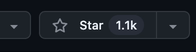
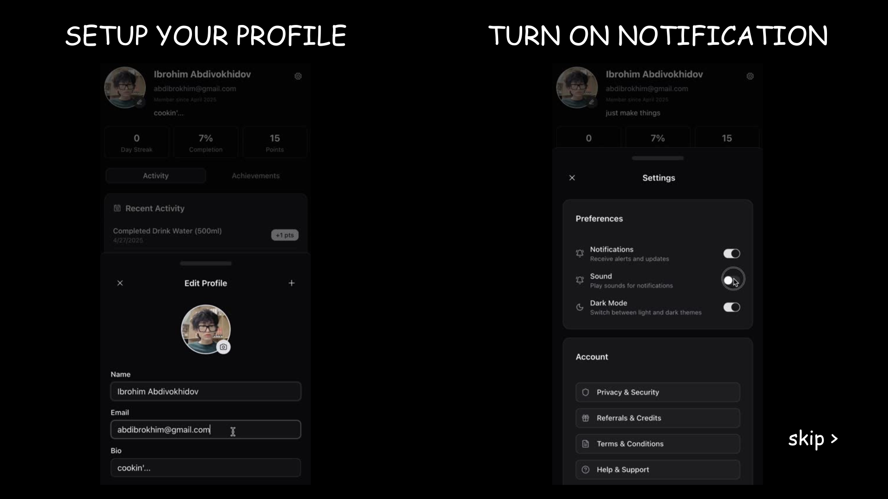

  

 

<h1> Wei: The AI Agents For Personal Growth
</h1>

[![Discord][discord-image]][discord-url]
[![X][x-image]][x-url]
[![Star][star-image]][star-url]

<h4 align="center">

[Community](https://discord.gg/nUdcd9p8Ae) |
[Contributing](./CONTRIBUTING.md) |
[Yaps.GG](https://www.yaps.gg)

</h4>

 

  

🌱 Wei is your conversational AI agent that makes habit-building effortless through natural dialogue. Speak with Wei, earn points for consistency, and transform daily routines into rewarding experiences—all with a playful personality that keeps you motivated on your wellness journey.

 

🌟 Star Wei on GitHub and be instantly notified of new releases.

 

    
  </a>

 

## ✨ Key Features

try Wei on your own!

<table>
  <tr>
    <td></td>
    <td></td>
  </tr>
  <tr>
    <td></td>
    <td></td>
  </tr>
</table>

 

## 📺 Demo Video

### Introducing Wei: The AI Agents For Personal Growth

 

## ⚙️ Quick Start

> Check out the [INSTALLATION.md](./INSTALLATION.md) for a step-by-step guide on how to get started with Wei.
> Deploy your own Wei Agent now! Check out the [DEPLOY.md](./DEPLOY.md).

## 📢 News

### Upcoming Features & Contributions

> We welcome community contributions! Join us in building these exciting features.

- [Support Video Streaming (e.g. live talk to AI Agents)](https://github.com/abdibrokhim/wei/issues/)

### Latest Updates

📢 First release of Wei. - 📆 April 28, 2025

- Wei GitHub repository initially launched - 📆 April 25, 2025

## 🥂 Contributing to Wei

> We greatly appreciate your interest in contributing to our open-source initiative. To ensure a smooth collaboration and the success of contributions, we adhere to a set of contributing guidelines similar to those established by Open Community. For a comprehensive understanding of the steps involved in contributing to our project, please refer to the Wei [CONTRIBUTING.md](./CONTRIBUTING.md). 🤝🚀
>
> An essential part of contributing involves not only submitting new features with accompanying tests (and, ideally, examples) but also ensuring that these contributions pass our automated pytest suite. This approach helps us maintain the project's quality and reliability by verifying compatibility and functionality.

### Contributors ✨

## 📬 Community & Contact

If you're keen on exploring new research opportunities or discoveries with our platform and wish to dive deeper or suggest new features, we're here to talk. Feel free to get in touch for more details at abdibrokhim@gmail.com.

 

- Join us ([*Discord*](https://discord.gg/nUdcd9p8Ae)) in pushing the boundaries of finding the scaling laws of agents.

## 🌟 Star History

> *⭐ If you find Wei interesting, consider starring this repo to help spread the word.*

## 🙌 Acknowledgment

We would like to thank [Ibrohim](https://linkedin.com/in/abdibrokhim) for designing the logo of our project.

## 📝 License

The source code is licensed under Apache 2.0.

[discord-image]: https://img.shields.io/discord/1325139842388070520?logo=discord
[discord-url]: https://discord.gg/nUdcd9p8Ae
[x-image]: https://img.shields.io/twitter/follow/abdibrokhim?style=social
[x-url]: https://x.com/abdibrokhim
[star-image]: https://img.shields.io/github/stars/abdibrokhim/wei?label=stars&logo=github&color=brightgreen
[star-url]: https://github.com/abdibrokhim/wei/stargazers
